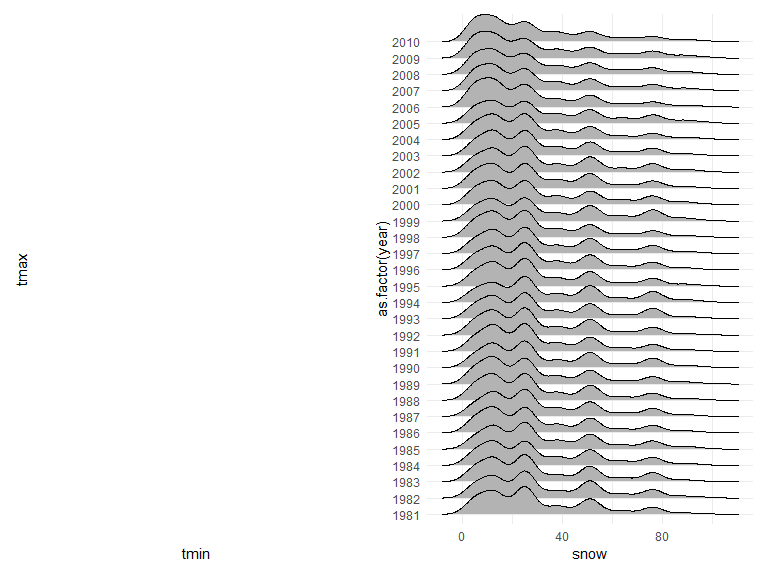
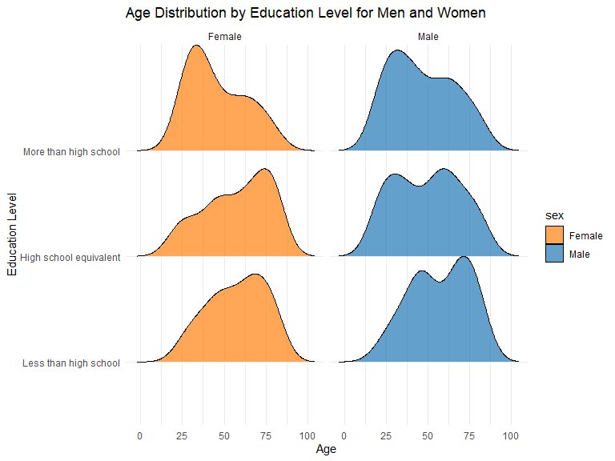
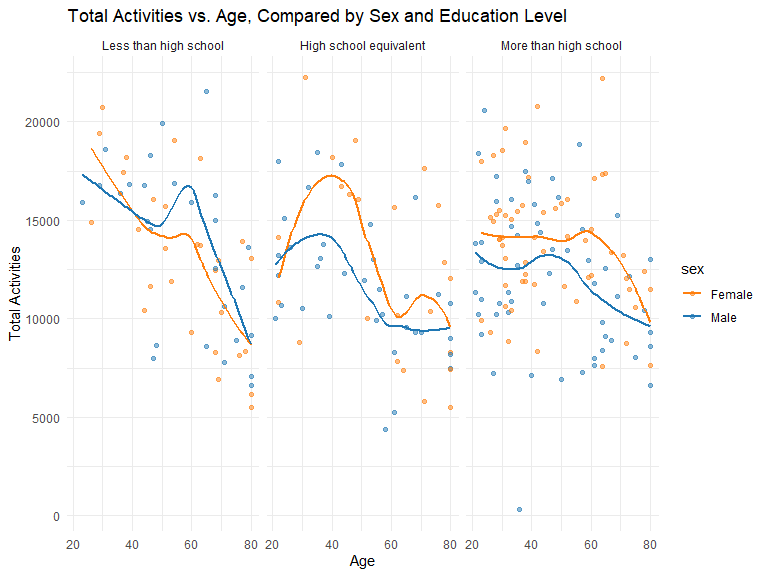
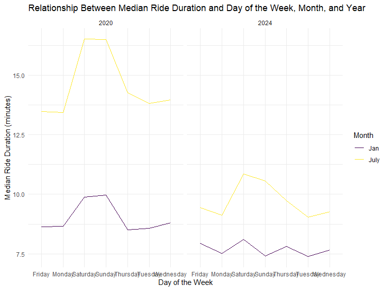
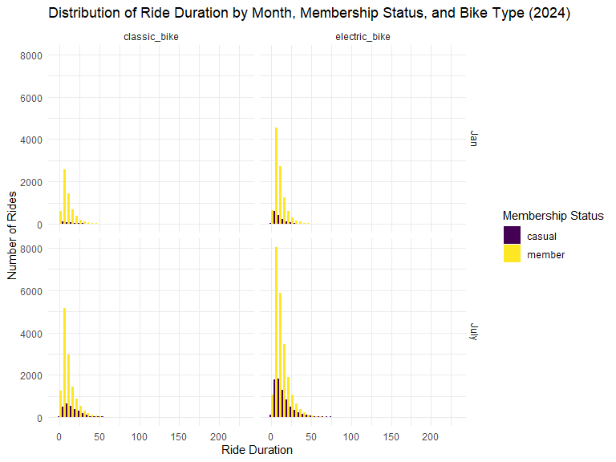

p8105_hw3_yj2802
================
Yizhen Jia
2024-10-16

### Problem 1

#### Read in the data

``` r
data("ny_noaa")
```

#### Answer questions about the data

This dataset contains 2595176 rows and 7 columns. Variables include
weather station id, date of observation, (tenths of mm), snowfall (mm),
snow depth (mm), and min and max temperature (tenths of degrees C).

Below we clean the data, creating separate variables for year, month,
and day and converting `tmax` and `tmin` to numeric. We find that 0 is
the most commonly observed value for snowfall. This is because most days
of the year, it does not snow at all in NY. The second most commonly
observed value is `NA`, indicating missingness. Other common values are
13, 25, and 51, suggesting that snowfall is originally recorded in
fractions of an inch and converted to mm.

``` r
ny_noaa |>  
  count(snow) |> 
  arrange(desc(n))
```

    ## # A tibble: 282 × 2
    ##     snow       n
    ##    <int>   <int>
    ##  1     0 2008508
    ##  2    NA  381221
    ##  3    25   31022
    ##  4    13   23095
    ##  5    51   18274
    ##  6    76   10173
    ##  7     8    9962
    ##  8     5    9748
    ##  9    38    9197
    ## 10     3    8790
    ## # ℹ 272 more rows

``` r
ny_noaa = 
  ny_noaa |> 
  separate(date, into = c("year", "month", "day"), convert = TRUE) |> 
  mutate(
    tmax = as.numeric(tmax),
    tmin = as.numeric(tmin))
```

Below is a two-panel plot showing the average max temperature in January
and in July in each station across years. As expected, the mean
temperature in January is much lower than the mean temperature in July
for all stations and across all years. All stations appear to follow
similar trends of temperature peaks and valleys within a month across
the years, i.e. when one station has a high monthly mean temperature for
a given year, most other stations also have a high monthly mean
temperature for that year. We do see one uncharacteristically cold
station in July of 1987 or 1988, as well as a few other less drastic
outliers.

``` r
ny_noaa |> 
  group_by(id, year, month) |> 
  filter(month %in% c(1, 7)) |> 
  summarize(mean_tmax = mean(tmax, na.rm = TRUE, color = id)) |> 
  ggplot(aes(x = year, y = mean_tmax, group = id)) + geom_point() + geom_path() +
  facet_grid(~month) +
  labs(title = "Mean monthly temperature for each station across years for January and July")
```

    ## `summarise()` has grouped output by 'id', 'year'. You can override using the
    ## `.groups` argument.


Below we show a two-panel plot including (i) a hex plot of `tmax` vs
`tmin` for the full dataset; and (ii) a ridge plot showing the
distribution of snowfall values (in mm) greater than 0 and less than 100
separately by year.

From the hex plot we see that while there is some variability, the
majority of the data cluster tightly in the center of the distribution.
In relatively rare cases, it seems that `tmax` is less than `tmin`,
which raises questions about data recording and quality.

From the ridge plot, we see a multimodal density of snowfall within a
given year. Most stations see between 0 and 35 mm of snow in a year.
Then there is a another group of stations that see about 45 mm of snow,
and another group that sees nearly 80 mm. It is likely this
multimodality stems from the conversion of measurements in one system
(fractions of an inch) to another (using the metric system), which was
also noted in the table of common values.

``` r
hex = 
  ny_noaa |> 
  ggplot(aes(x = tmin, y = tmax)) + 
  geom_hex()

ridge = 
  ny_noaa |> 
  filter(snow < 100, snow > 0) |>
  ggplot(aes(x = snow, y = as.factor(year))) + 
  geom_density_ridges()

hex + ridge
```

    ## Picking joint bandwidth of 3.76



### Problem 2

This problem uses accelerometer data collected on 250 participants in
the NHANES study. Two datasets including informaton of the participants’
demographic data their accelerometer data, respectively.

#### First, import the `nhanes_covar.csv` dataset:

The dataset includes: SEQN, sex, age, BMI and education status of 250
participants. Those are missing demographic data and those are less than
21 years old should be excluded; SEQN, sex and education should not be
numeric.

``` r
covar = 
  read_csv("C:/Users/22865/OneDrive/Desktop/Data Science 1/HWs/p8105_hw3_yj2802/nhanes_covar.csv", skip = 4,
             na = c("NA"), 
             col_types = cols(SEQN = "c", sex = "c", age = "n", BMI = "n", education = "c")) |>
  janitor::clean_names() |>
  drop_na(seqn, sex, age, bmi, education) |>
  filter(age >= 21)
```

After cleaning the data, the covar dataset now has 5 variables and 228
observations.

Now, create a table for the number of men and women in each education
category.

``` r
covar = covar |>
  mutate(
    sex = recode(sex, `1` = "Male", `2` = "Female"),
    education = recode(education, 
                       `1` = "Less than high school", 
                       `2` = "High school equivalent", 
                       `3` = "More than high school")
  ) |>
  mutate(
    education = factor(education, 
                       levels = c("Less than high school", 
                                  "High school equivalent", 
                                  "More than high school"),
                       ordered = TRUE)
  )

p2_table = covar |>
  group_by(education, sex) |>
  summarize(count = n(), .groups = 'drop') |>
  pivot_wider(names_from = sex, values_from = count, values_fill = 0) |>
  knitr::kable()

p2_table
```

| education              | Female | Male |
|:-----------------------|-------:|-----:|
| Less than high school  |     28 |   27 |
| High school equivalent |     23 |   35 |
| More than high school  |     59 |   56 |

Then, create a visualization of the age distributions for men and women
in each education category

``` r
ggplot(covar, aes(x = age, y = education, fill = sex)) +
  geom_density_ridges(alpha = 0.7, scale = 1) +
  facet_wrap(~sex) +
  labs(
    title = "Age Distribution by Education Level for Men and Women",
    x = "Age",
    y = "Education Level"
  ) +
  theme_minimal() +
  scale_fill_manual(values = c("Male" = "#1f77b4", "Female" = "#ff7f0e"))
```

    ## Picking joint bandwidth of 7.95

    ## Picking joint bandwidth of 8.11



#### Comments on the table and plot:

The table shows that the “More than high school” category has the
highest count for both males (56) and females (59), while the “Less than
high school” category has nearly equal counts for both genders. The
ridge plot reveals that higher education levels correspond to younger
age distributions, whereas lower education levels are associated with a
broader and older age range.

#### Then, import the `nhanes_accel.csv` dataset and merge 2 datasets:

``` r
accel = read_csv("C:/Users/22865/OneDrive/Desktop/Data Science 1/HWs/p8105_hw3_yj2802/nhanes_accel.csv",
             col_types = cols(SEQN = "c")) |>
  janitor::clean_names()

p2_final = covar |> inner_join(accel, by = "seqn")
```

The merged dataset “p2_final” has 1445 variables, including demographic
and accelerometer data for 228 observations.

#### Create a total activity variable for each participant:

``` r
activity_columns = select(p2_final, starts_with("min"))
p2_final = p2_final |>
  mutate(total_activities = rowSums(activity_columns, na.rm = TRUE))
```

#### Plot these total activities against age:

``` r
ggplot(p2_final, aes(x = age, y = total_activities, color = sex)) +
  geom_point(alpha = 0.5) +
  geom_smooth(method = "loess", se = FALSE) +
  facet_wrap(~ education) +
  labs(
    title = "Total Activities vs. Age, Compared by Sex and Education Level",
    x = "Age",
    y = "Total Activities"
  ) +
  theme_minimal() +
  scale_color_manual(values = c("Male" = "#1f77b4", "Female" = "#ff7f0e"))
```

    ## `geom_smooth()` using formula = 'y ~ x'



This plot shows the relationship between total daily activities and age,
comparing men and women across different education levels. The activity
patterns generally decline with age, and men tend to have slightly lower
total activities compared to women, particularly in the “More than high
school” category.

#### Make a three-panel plot that shows the 24-hour activity time courses for each education level:

``` r
p2_long = p2_final |>
  pivot_longer(
    cols = starts_with("min"),
    names_to = "minute",
    names_prefix = "min",
    values_to = "activity"
  ) |>
  mutate(minute = as.numeric(minute))
ggplot(p2_long, aes(x = minute, y = activity, color = sex)) +
  geom_line(alpha = 0.7) +
  facet_wrap(~ education) +
  labs(
    title = "24-Hour Activity Time Courses by Education Level",
    x = "Minute of the Day",
    y = "Activity (MIMS)",
    color = "Sex"
  ) +
  theme_minimal() +
  scale_color_manual(values = c("Male" = "#1f77b4", "Female" = "#ff7f0e"))
```


This graph shows a consistent pattern of daily activity peaks for both
men and women across all education levels. Men generally exhibit higher
activity levels, especially in the “More than high school” category,
while women show more sporadic peaks in activity. There is less
variation in activity levels at the start and end of the day across all
education levels.

### Problem 3

#### Import, clean and combine datasets:

``` r
Jan2020 = 
  read_csv("C:/Users/22865/OneDrive/Desktop/Data Science 1/HWs/p8105_hw3_yj2802/citibike/Jan 2020 Citi.csv",
             col_types = cols(duration = "n")) |>
  janitor::clean_names() |>
  mutate(year="2020", month = "Jan")

Jan2024 = 
  read_csv("C:/Users/22865/OneDrive/Desktop/Data Science 1/HWs/p8105_hw3_yj2802/citibike/Jan 2024 Citi.csv",
             col_types = cols(duration = "n")) |>
  janitor::clean_names() |>
  mutate(year="2024", month = "Jan")

July2020 = 
  read_csv("C:/Users/22865/OneDrive/Desktop/Data Science 1/HWs/p8105_hw3_yj2802/citibike/July 2020 Citi.csv",
             col_types = cols(duration = "n")) |>
  janitor::clean_names() |>
  mutate(year="2020", month = "July")

July2024 = 
  read_csv("C:/Users/22865/OneDrive/Desktop/Data Science 1/HWs/p8105_hw3_yj2802/citibike/July 2024 Citi.csv",
             col_types = cols(duration = "n")) |>
  janitor::clean_names() |>
  mutate(year="2024", month = "July")

p3_final = bind_rows(Jan2020, Jan2024, July2020, July2024)
```

The result dataset contains Citi Bike data of 4 months, and has 9
variables and 99485 observations. Including virables of ride_id,
rideable_type, weekdays, duration, start_station_name, end_station_name,
member_casual, year, month

#### Create table 1:

Table 1 shows the total number of rides in each combination of year and
month separating casual riders and Citi Bike members:

``` r
table1 = p3_final |>
  group_by(year, month, member_casual) |>
  summarize(total_rides = n(), .groups = 'drop')
table1
```

    ## # A tibble: 8 × 4
    ##   year  month member_casual total_rides
    ##   <chr> <chr> <chr>               <int>
    ## 1 2020  Jan   casual                984
    ## 2 2020  Jan   member              11436
    ## 3 2020  July  casual               5637
    ## 4 2020  July  member              15411
    ## 5 2024  Jan   casual               2108
    ## 6 2024  Jan   member              16753
    ## 7 2024  July  casual              10894
    ## 8 2024  July  member              36262

#### Create table 2:

Table 2 shows the 5 most popular starting stations for July 2024:

``` r
table2 = p3_final |>
  mutate(year = as.character(year), month = as.character(month)) |>
  filter(year == "2024", month == "July") |>
  group_by(start_station_name) |>
  summarize(total_rides = n(), .groups = 'drop') |>
  arrange(desc(total_rides)) |>
  head(5)
table2
```

    ## # A tibble: 5 × 2
    ##   start_station_name       total_rides
    ##   <chr>                          <int>
    ## 1 Pier 61 at Chelsea Piers         163
    ## 2 University Pl & E 14 St          155
    ## 3 W 21 St & 6 Ave                  152
    ## 4 West St & Chambers St            150
    ## 5 W 31 St & 7 Ave                  146

#### Create the plot:

The plot shows the effects of day of the week, month, and year on median
ride duration:

``` r
median_duration_data = p3_final |>
  group_by(year, month, weekdays) |>
  summarize(median_duration = median(duration, na.rm = TRUE), .groups = 'drop')

ggplot(median_duration_data, aes(x = weekdays, y = median_duration, color = month, group = interaction(month, year))) +
  geom_line() +
  facet_wrap(~ year) +  # Panel by year
  labs(title = "Relationship Between Median Ride Duration and Day of the Week, Month, and Year",
       x = "Day of the Week", y = "Median Ride Duration (minutes)",
       color = "Month") +
  theme_minimal()
```



#### Create the figure

The p3_figure shows the impact of month, membership status, and bike
type on the distribution of ride duration for data in 2024:

``` r
data_2024 = p3_final |>
  filter(year == "2024")

ggplot(data_2024, aes(x = duration, fill = member_casual)) +
  geom_histogram(binwidth = 5, position = "dodge") +
  facet_grid(month ~ rideable_type) +
  labs(title = "Distribution of Ride Duration by Month, Membership Status, and Bike Type (2024)",
       x = "Ride Duration", 
       y = "Number of Rides",
       fill = "Membership Status") +
  theme_minimal()
```



The plot shows that most Citi Bike rides in both January and July 2024,
regardless of bike type or membership status, have relatively short
duration, with the majority of rides lasting under 50 minutes.
Additionally, members account for a significantly higher number of rides
compared to casual riders.
